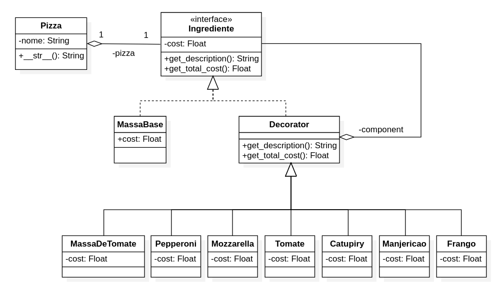
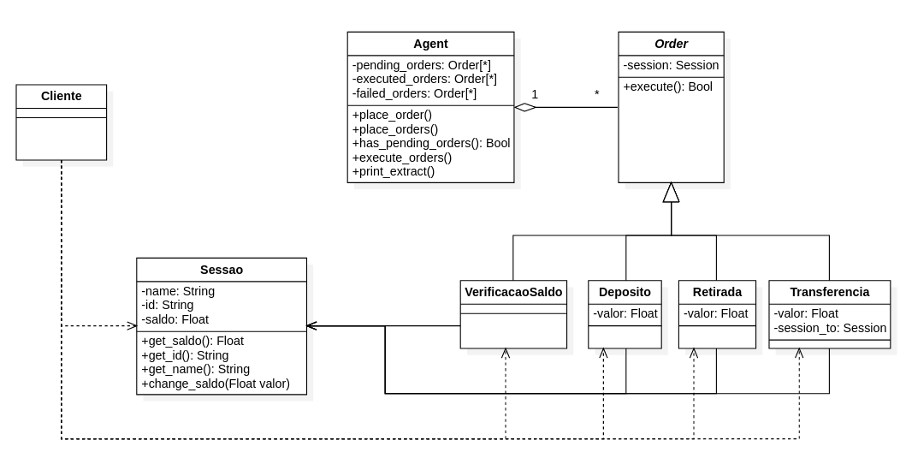

# Exercício de Laboratório 2

#### Aluno: Guilherme Kowalczuk

---
### Exercício 1

Considerando o exemplo do CoffeShop com Padrão de Projeto Decorator. Crie um
exemplo que construa Pizzas. Ao invés de itens para um café, usar ingredientes de
pizza. O Diagrama de Classes deve ser elaborado.

---

## Exercício 2

Uma aplicação para um Banco executa operações tais como verificar saldos, extratos
e realizar transferências. Utilize o Padrão de Projeto Command para modelar o
processamento de solicitações do cliente para a aplicação do Banco. Implemente um
programa em Python para simular a interação entre a aplicação cliente e a aplicação
do Banco. O Diagrama de Classes deve ser elaborado.

